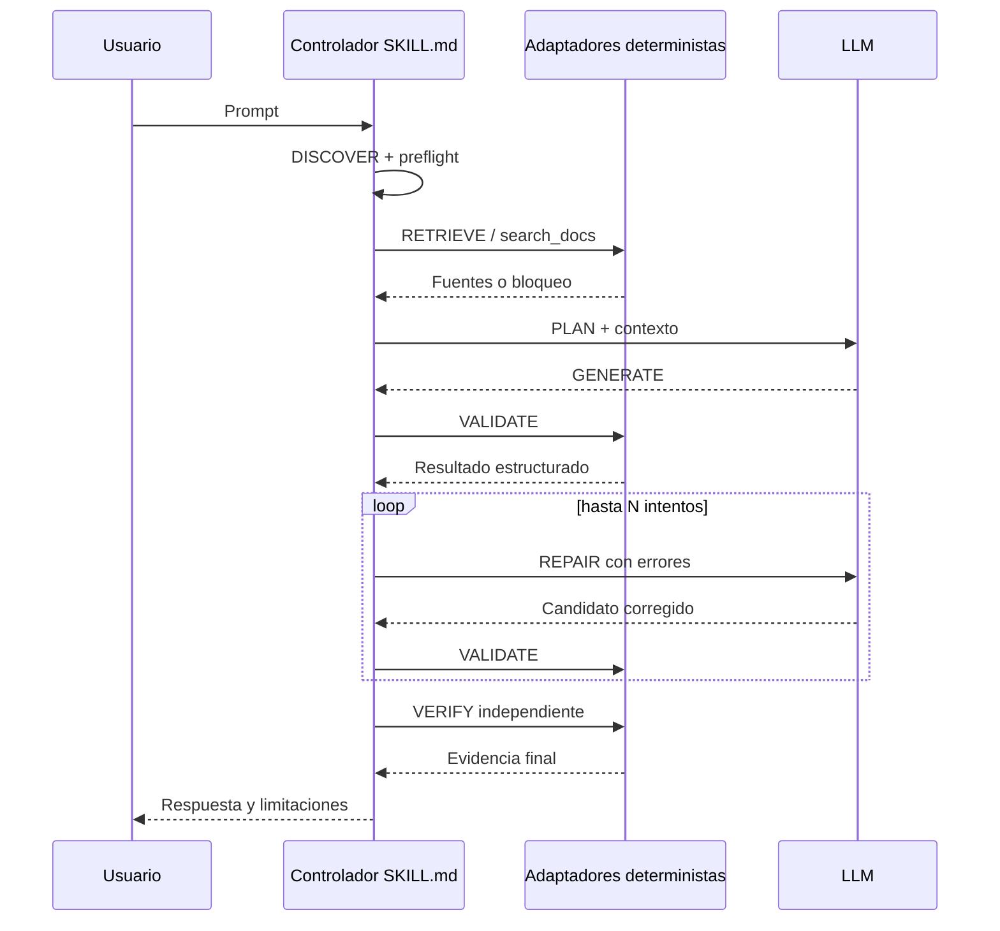

# Contrato del flujo programático

Este es el contrato canónico de ejecución. Una tarea no entrega un artefacto generado sin pasar por las etapas aplicables y sus criterios de parada.

## Flujo rápido

```text
DISCOVER → RETRIEVE → PLAN → GENERATE → VALIDATE → REPAIR (≤ N) → VERIFY
    ↑                                                        │
    └────────────── bloqueo declarado si falta evidencia ────┘
```

`RETRIEVE` es obligatorio antes de `GENERATE` cuando la tarea depende de documentación, código, schemas, comandos o decisiones del repositorio. `VALIDATE` es obligatorio antes de entregar. `VERIFY` es final e independiente de la generación.

## Siete etapas

| Etapa | Propósito e inputs | Acciones deterministas | Evidencia / salida | Parada |
|---|---|---|---|---|
| **DISCOVER** | Entender prompt y skills disponibles | Resolver preflight de [`repository-targeting.md`](repository-targeting.md); evaluar nombre y `description` | Skill seleccionada, repositorio objetivo y alcance | Detener si hay destino ambiguo o no hay skill aplicable |
| **RETRIEVE** | Obtener contexto verificable | Ejecutar `search_docs` o adaptador equivalente; registrar fuentes, versión y límites | Paquete de contexto con origen y estado | Bloquear si falta el adaptador o la fuente requerida; no inventar |
| **PLAN** | Convertir evidencia en plan | LLM separa hechos, supuestos a validar, cambios y criterios de aceptación | Plan trazable a fuentes y archivos | Detener si un supuesto crítico no puede validarse |
| **GENERATE** | Producir cambio o respuesta | LLM adapta el plan; usar transformaciones repetibles cuando existan | Candidato, diff o respuesta provisional | No entregar todavía |
| **VALIDATE** | Detectar defectos objetivos | Ejecutar `validate`; comprobar schema, sintaxis, lint, tests o reglas disponibles | Resultado estructurado con errores y comandos | Pasar solo con estado válido; si falla, ir a REPAIR |
| **REPAIR** | Corregir defectos conocidos | LLM aplica reparaciones basadas en errores; repetir VALIDATE hasta `N` intentos | Historial de intentos y errores resueltos | Parar al alcanzar `N` o ante error no reparable |
| **VERIFY** | Probar el resultado final de forma independiente | Ejecutar `verify`; revisar diff, criterios, aislamiento y estado final | Evidencia final, limitaciones y estado | Entregar solo si verifica; si no, declarar fallo |

`N` debe estar explícito en la skill o proyecto; el valor predeterminado recomendado es 3. Un intento no equivale a reintentar ciegamente: cada reparación debe tener un error observable y un cambio acotado.

## Resultado mínimo de validación

```json
{
  "status": "invalid",
  "adapter": "validate",
  "version": "project-defined",
  "errors": [
    {"code": "SCHEMA_MISSING_FIELD", "message": "Falta `title`", "path": "output.json"}
  ],
  "warnings": [],
  "commands": ["project-validator --check output.json"],
  "reproducible": true,
  "repair_attempt": 1
}
```

Los comandos y códigos son ejemplos: cada proyecto debe declarar los reales. Si un adaptador no existe, la salida es `blocked` con la limitación explícita; no se reemplaza por una suposición.

## Secuencia operativa


